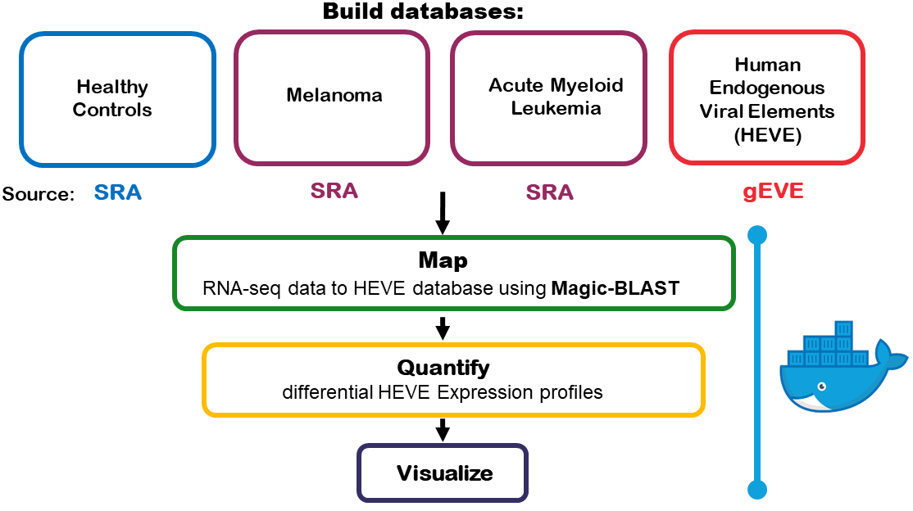

# RetroCancer

# What are Human Endogenous Retroviruses (HERVs)?
About 8% of human genome is composed of human endogenous retroviruses (HERVs), which are remnants of ancient retroviruses that have infected human genome millions of years ago. 
Most of HERVs are nonfunctional due to the acquisition of deactivating mutations, deletions, rearrangements during host evolution [Classification and characterization of human endogenous retroviruses; mosaic forms are common](https://retrovirology.biomedcentral.com/articles/10.1186/s12977-015-0232-y) as well as due to [epigenetic control mechanisms](https://www.ncbi.nlm.nih.gov/pmc/articles/PMC4131434/).

# Why is HERV expression important ?

While HERVs are commonly silent, activation of their expression has been described in many cancers. While causative relation between HERV and tumorigenesis is still unclear [reference3](https://www.ncbi.nlm.nih.gov/m/pubmed/24511094/) [reference4](https://www.sciencedirect.com/topics/biochemistry-genetics-and-molecular-biology/retroviruses), an intriguing strategy suggests the use of HERV antigens as potential targets for immunotherapy.

# Why use RetroCancer ?

RetroCancer is an open-source software tool for the characterization of human endogenous viral element (EVE, which include HERVs) expression in cancer. It enables to find HERV expression profiling for a patient or tumor type of interest on the examples of melanoma and acute myeloid leukemia. This aids in understanding of HERV associated tumorigenic mechanism and identifying potential targets for novel immunotherapeutic treatment strategies based on manipulating immune response against the HERV antigens that are selectively expressed in tumor cells. In addition, it evaluates HERV threshold to classify samples. This threshold based classification based on the HERV profiling helps in understanding whether a specific HERV expression profile improves response to the currently available immunotherapy treatment, enabling novel companion diagnostic strategies for target population selection.

RetroCancer Workflow Diagram:

