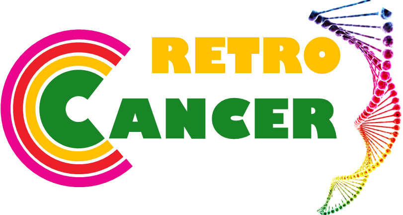

# RetroCancer

# What are Endogenous Retroviruses(ERVs)?
"Endogenous retroviruses (ERVs) are remnants of ancient active retroviruses that infected germline cells, and these viruses are transmitted vertically through successive generations in a Mendelian fashion. ERVs have undergone repeated amplification and transposition to such an extent that human endogenous retroviruses (HERVs), which integrated into the human genome 30–40 million years ago, currently make up about 8% of the human genome sequence" [ref1](https://retrovirology.biomedcentral.com/articles/10.1186/1742-4690-8-90)

# Why are these important ?
ERVs lack infectious capacity due to accumulated nonsense mutations,indels of internal coding regions & long terminal repeats (LTRs), which serve as the retroviral promoters. Despite changes HERVs have intact open reading frames (ORFs) that encode functional proteins and in some cases can form retrovirs like particles.[ref2](https://retrovirology.biomedcentral.com/articles/10.1186/1742-4690-8-90).HERvs along with beneficial roles, have also been associated with a variety of human diseases and disorders. However, no concrete beneficial or harmful effects have yet been establised.[ref3](https://www.nature.com/articles/srep41960)   

# What is RetroCancer going to do ?

# RetroCancer Workflow

